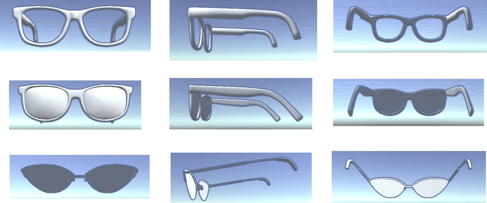
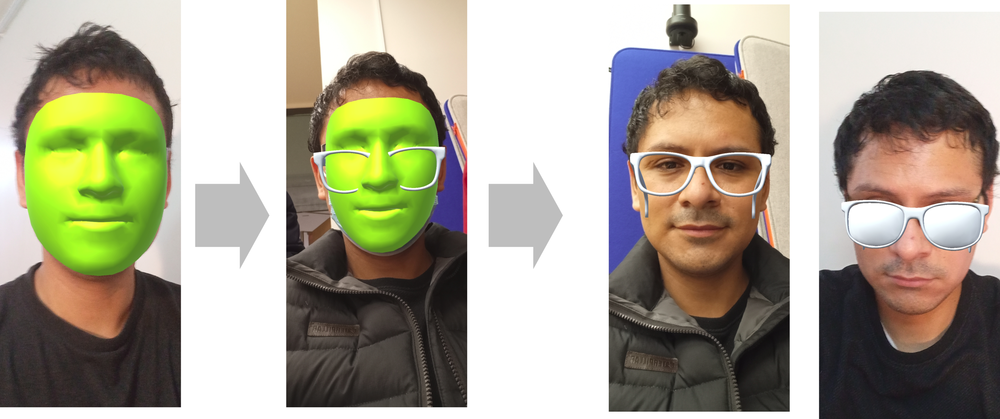

[](https://unity3d.com)
[](https://opensource.org/licenses/mit-license.php)
[](https://github.com/dennishnf/project-xr-glasses/issues)
[](https://github.com/ellerbrock/open-source-badges/)
[](https://twitter.com/intent/tweet?text=Download%20and%20use%20the%20Project%20XR%20Glasses&url=https://github.com/dennishnf/project-xr-glasses&hashtags=unity,augmentedreality,unity3d,facedetection,arkit)


# Project XR Glasses


## Description

Select the best glasses is time consuming and need to physically search in different shops.    

Here we implement a Real-Time Virtual Reality App for Android Devices that helps people to test a different variety of glasses without the need to physically test them. 


## Unity version


Developed in: Ubuntu 20.04 LTS    
Unity version: 2020.3.20f1    
Unity Packages:    
ProBuilder    
AR Foundation    
AR Core XR Plugin    
ARKit Face Tracking    
ARKit XR Plugin    

Intended Devices:    
Android Smartphone    
Versions >= 8.1.0 Oreo    
Tested on:    
Samsung Galaxy A32 (Android 11)    
Samsung Galaxy S10 (Android 11)    


## Wireframes

<p align="center">

</p>

## Flowchart

<p align="center">

</p>


## Pseudo code: 

```
start the face detection
perform landmark extraction
run pre defined glasses models

for selected_glasses in models_list:
	anchor the points of face with glass 3d model
	show the face with the glasses
	read option of glasses
```


## Updates

### Update 23 Nov 2021:

Face detection and extraction of the most relevant points of the face were successfully implemented. The AR Foundation and ARKit Face Tracking packages were used for this purpose. The main challenges faced were: compatibility with android devices and successfully configuring the building options. 

<p align="center">

</p>


### Update 30 Nov 2021:

Different lens models were collected in .obj format, but were converted to .prefab by creating a prefab object and then pulling the .obj lenses into that object. In addition, we tried to instantiate between a prefab object and a landmark point of the face, but we had problems with finding the indicated references.

<p align="center">

</p>


### Update 07 Dec 2021:

Successfully performed the attachment of a reference point of the face, and the placement of the lenses. This was done in several stages, in the first tests a prefab object was instantiated, then the position of the eyes was extracted and the position and rotation transformations were instantiated to that prefab object.

<p align="center">

</p>


## Demos

<p align="center">


</p>


## Using this repository

Download or clone, then Settings Build and Run, then Switch Platform to Android.

Also, install the packages: AR Fundation, AR Core XR Plugin, ARKit Face Tracking, ARKit XR Pluigin.    


## References

- [Setting Up AR Foundation](https://learn.unity.com/tutorial/setting-up-ar-foundation#5fe2be51edbc2a1f5e69872f)    
- [ARKit Face Tracking](https://docs.unity3d.com/Packages/com.unity.xr.arkit-face-tracking@4.1/manual/index.html)    
- [Unity AR Foundation Tutorial - Getting Started with Face Tracking](https://www.youtube.com/watch?v=y0L_AdJICEU)    
- [Unity3d ARKit Face Tracking and placing face game objects with anchor data
](https://www.youtube.com/watch?v=JQEovMKq2U0)    


## Group

- Miky ([@MrMazagngy](https://github.com/MrMazagngy))   
- Yao ([@iyfyao](https://github.com/iyfyao))    
- Dennis ([@dennishnf](https://github.com/dennishnf))   


<!---

git pull
git add -A
git commit -m "v0"
git push -u origin main

--->

