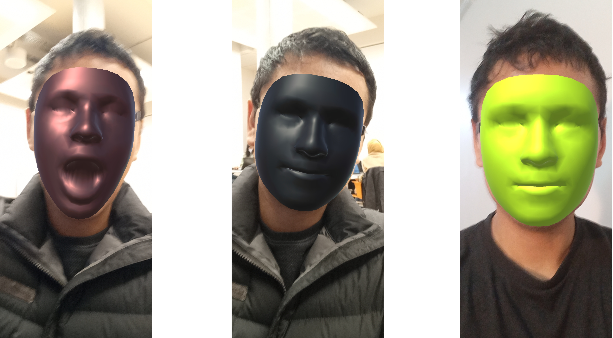

# Project XR Glasses


## Description

This project consists of the development of an augmented reality application that allows users to quickly and easily try on various models of glasses and visualize in real time the price as well as their design. 


## Unity version

Unity Version: 2020.3.20f1   
Developing Platforms: Ubuntu 20.04 
Intended Devices: Android   


## Flowchart

<p align="center">

</p>


## Pseudo code: 

```
start the face detection
perform landmark extraction
run pre defined glasses models

for selected_glasses in models_list:
	anchor the points of face with glass 3d model
	show the face with the glasses
	read option of glasses
```


## Updates

### Update 23 Nov 2021:

All members of the group managed to successfully implement Face Tracking using Unity AR Foundation. This way we were able to detect the face on an android device. 

The main challenges faced were: compatibility with android devices and successfully configuring the building options. 

<p align="center">

</p>


### Update 30 Nov 2021:

All members of the group managed to successfully implement Face Tracking using Unity AR Foundation. This way we were able to detect the face on an android device. 

The main challenges faced were: compatibility with android devices and successfully configuring the building options. 

<p align="center">

</p>


### Update 07 Nov 2021:

All members of the group managed to successfully implement Face Tracking using Unity AR Foundation. This way we were able to detect the face on an android device. 

The main challenges faced were: compatibility with android devices and successfully configuring the building options. 

<p align="center">

</p>

<!---

### Update 30 Nov 2021:

Successfully implemented the anchoring between the face points and the 3d lens model in unity.

<p align="center">

</p>

--->


## Using this repository

Download or clone, then Settings Build and Run, then Switch Platform to Android.

Packages:

- AR Fundation   

- AR Core XR Plugin   

- ARKit Face Tracking   

- ARKit XR Pluigin       


## References

- [Setting Up AR Foundation](https://learn.unity.com/tutorial/setting-up-ar-foundation#5fe2be51edbc2a1f5e69872f)

- [ARKit Face Tracking](https://docs.unity3d.com/Packages/com.unity.xr.arkit-face-tracking@4.1/manual/index.html)

- [Unity AR Foundation Tutorial - Getting Started with Face Tracking](https://www.youtube.com/watch?v=y0L_AdJICEU)

- [Unity3d ARKit Face Tracking and placing face game objects with anchor data
](https://www.youtube.com/watch?v=JQEovMKq2U0)


## Group

- Miky  

- Yao    

- Dennis   


<!---

git pull
git add -A
git commit -m "v0"
git push -u origin main

--->

