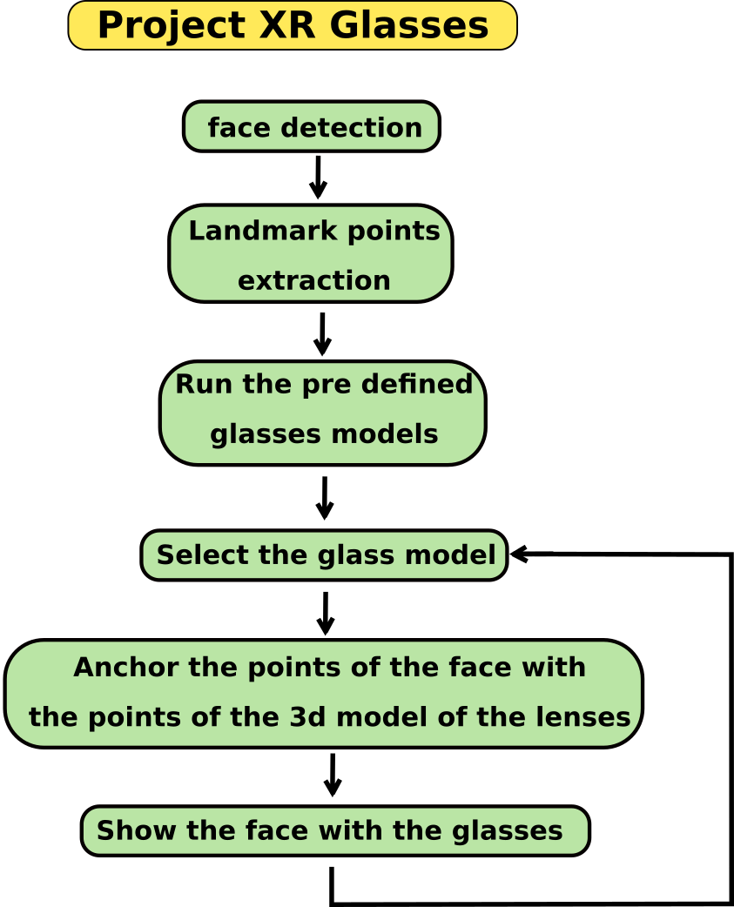

# Project Glasses

Repository for Glasses project of Extended reality (XR)

### Unity version: 2020.3.20f1

### Update 23 Nov 2021:

All members of the group managed to successfully implement Face Tracking using Unity AR Foundation. This way we were able to detect the face on an android device. 

The main challenges faced were: compatibility with android devices and successfully configuring the building options. 

### Update 30 Nov 2021:

Se ha implementado exitosamente 

Group: Miky, Yao, Dennis

